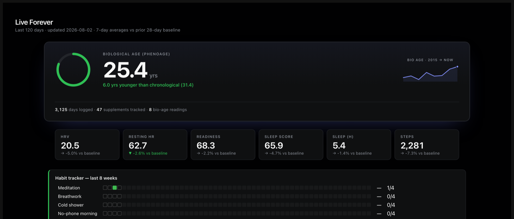
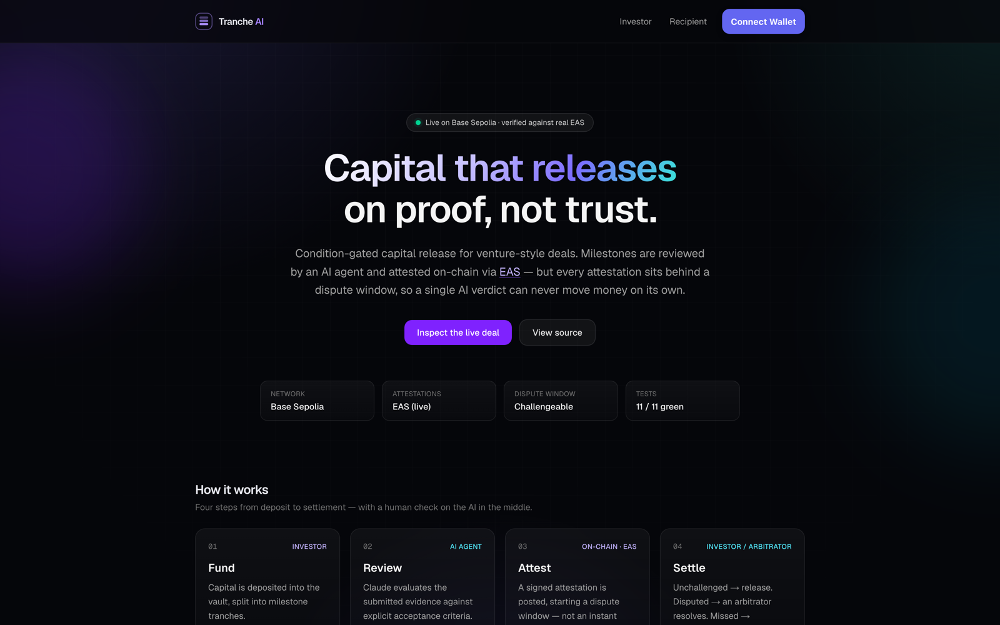

# Hi, I'm Bakul

- 🎓 MBA @ UVA Darden '27 - applied AI operator-builder
- 🛠️ Bio/longevity, blockchain, VC and PE, AI-native services, e-learning, etc.
- 📫 Badwalb27@darden.virginia.edu

## Projects

### Bio/Longevity

**LiveForever** *(live, private)* — personal health control tower unifying wearables (Oura Ring, Apple Health, Whoop), 10+ years of clinical bloodwork & daily self-logged training/habits, and personal genomics (DNA via 23andMe) into one owned data layer.
> **OpenAI Build Week 2026:** [Public version - Live →](https://bakulbadwal.github.io/liveforever-buildweek/) · [Repo](https://github.com/bakulbadwal/liveforever-buildweek)

Benchmarks **PhenoAge** biological-age, N-of-1 correlation analysis quantifying what each input does to HRV, recovery, resilience scores + 28-day analysis on interventions. 

**[PhaseSignal](https://github.com/bakulbadwal/phasesignal) ([Live →](https://bakulbadwal.github.io/phasesignal/))** — scores live ClinicalTrials.gov data against a base rate, reweighted across four factors. 

### AI × Blockchain

**[TraceHound](https://github.com/bakulbadwal/tracehound) ([Live →](https://tracehound.vercel.app))** — agentic crypto hack tracer: live hop-by-hop tracing and narration from compromised wallet via Etherscan API, cross-references OFAC sanctioned addresses from U.S. Treasury's SDN watchlist. Built from experience with federal law enforcement on crypto crime. 

Also runs as a [read-only MCP server](https://github.com/bakulbadwal/tracehound#mcp-server) — any agent can run a trace and get back cited evidence. 

**[Tranche AI](https://github.com/bakulbadwal/tranche-ai) ([Live →](https://tranche-ai.vercel.app))** — condition-gated capital release for VC deals, designed for AI-agent milestone review; smart contract + dispute flow live on Base Sepolia (EAS attestations). Solidity. 

### AI × VC & PE

**[Deal Docket](https://github.com/bakulbadwal/dealdocket) ([Live →](https://bakulbadwal.github.io/dealdocket/))** — deal-screening dashboard built around an AI-enabled service-roll-up thesis; adjustable five-box scoring framework. 

**[AI Stack](https://github.com/bakulbadwal/aistack) ([Live →](https://aistacked.netlify.app/))** — interactive map of the AI industry from silicon to application layer, value accrual, token cost calculator. 

**[AI Frontier Dispatch](https://github.com/bakulbadwal/ai-frontier-dispatch)** — personalizable AI + markets briefing: track frontier builders (Grok API for live X read), GitHub/Hugging Face, deals/careers signals. One-line plugin install for any harness.

**Orbit** *(private)* — relationship intelligence engine scores tie strength from live email and LinkedIn records, auto-schedules follow-ups. Obsidian graph + dashboard. 

### E-Learning

**[IB Technicals Fluency Trainer](https://github.com/bakulbadwal/ibtrainer)** — merger-model cockpit, purchase-price allocator, DCF sensitivity heatmap - live playgrounds. 

**[Consulting Case Prep Trainer](https://github.com/bakulbadwal/consultingtrainer)** — profit-diagnosis game, market-sizing builder, exhibit reader. Includes a designed [eval harness](https://github.com/bakulbadwal/consultingtrainer/tree/main/evals): golden set, two-axis LLM judge, calibration plan.

**[The Operator's P&L Room](https://github.com/bakulbadwal/p-lroom)** — eight-quarter run-the-business simulator under leverage & covenants, 13-week cash-crisis room for distress-operator decision making.

## Evals

LLM products shipped with tests: **golden set · deterministic policy gate · LLM-judge rubric · calibration plan (TPR/TNR, bias correction)** — each states what's validated vs. designed.

- [TraceHound evals](https://github.com/bakulbadwal/tracehound/tree/main/evals) — executable deterministic gate (`npm run eval`) over a golden set: catches invented hops, false and unsafe claims, missing evidence citations. The [MCP server](https://github.com/bakulbadwal/tracehound#mcp-server) returns cited evidence records with stable IDs to a consuming agent.
- [Consulting Trainer evals](https://github.com/bakulbadwal/consultingtrainer/tree/main/evals) — 12-scenario golden set with deliberate tempting-wrong-answers, two-axis LLM judge with anti-halo instructions, calibration plan.

## Product Case Studies

Short product write-ups — **problem · users · product decisions & tradeoffs · how I'd measure success · roadmap**:

| Project | The product-thinking angle |
|---|---|
| **[TraceHound →](https://github.com/bakulbadwal/tracehound/blob/main/CASE_STUDY.md)** | Agentic AI for underserved users; rigor about a tool's limits |
| **[AI Frontier Dispatch →](https://github.com/bakulbadwal/ai-frontier-dispatch/blob/master/CASE_STUDY.md)** | Generalizing a personal tool for others' setups; borrow vs. build |
| **[Tranche AI →](https://github.com/bakulbadwal/tranche-ai/blob/main/CASE_STUDY.md)** | Scoping a frontier problem in VC |
| **[OpenAI Build Week '26: LiveForever →](https://github.com/bakulbadwal/liveforever-buildweek/blob/main/CASE_STUDY.md)** | Separating deterministic evidence from model interpretation |
| **[The AI Stack →](https://github.com/bakulbadwal/aistack/blob/main/CASE_STUDY.md)** | Mapping where value accrues across AI |
| **[Recruiting Trainer Suite →](https://github.com/bakulbadwal/ibtrainer/blob/main/CASE_STUDY.md)** | Framing three tools as one product line; retention-first design |
| **[PhaseSignal →](https://github.com/bakulbadwal/phasesignal/blob/main/CASE_STUDY.md)** | Transparency vs. black-box incumbents |
| **[Deal Docket →](https://github.com/bakulbadwal/dealdocket/blob/main/CASE_STUDY.md)** | Making assumptions visible; build-vs-backend judgment |

## How these are built

Most are self-contained apps — vanilla HTML/CSS/JS, no framework, no build step, no dependencies — designed, built, and shipped solo end-to-end. Some split data from rendering (`data.json` + `app.js`) for content updates. Some use a real Python data pipeline (`data/build_dataset.py`) that pulls and scores live data. TraceHound is a Next.js app with server-side API keys.

     

## Connect

[LinkedIn](https://www.linkedin.com/in/bakulbadwal/) · [Email](mailto:badwalb@gmail.com)
